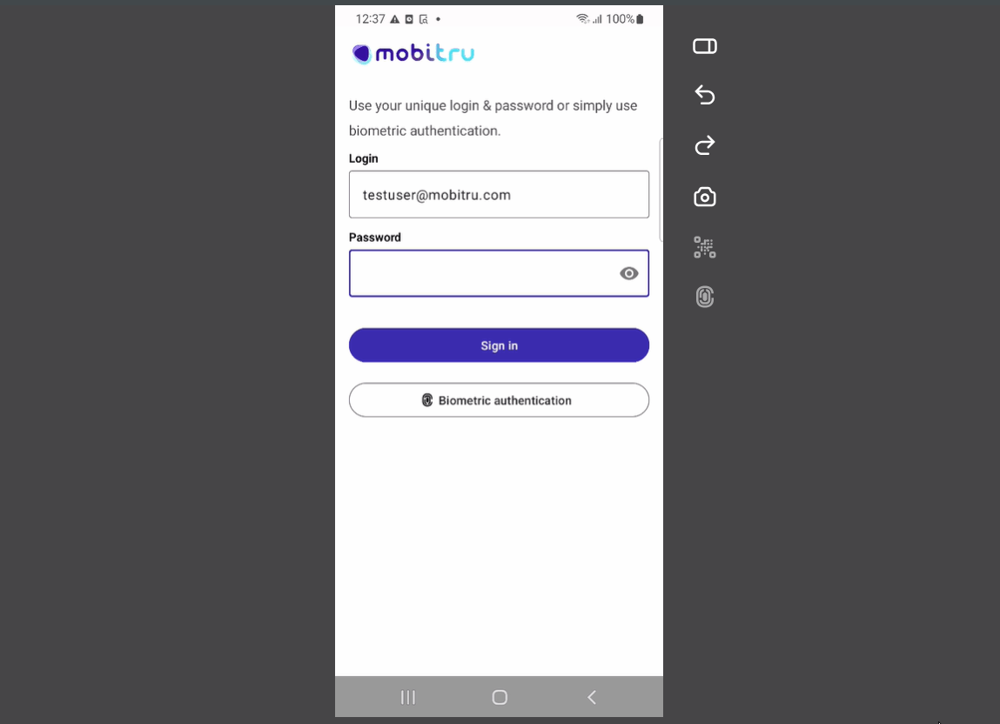
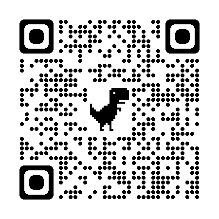

# Mobitru Android Demo Application

In this repository, you will find our Mobitru Android demo App.
You can use it as a demo App for test automation or manual practice on your local machine or on the Real Device Platform.

## Table of contents
1. [Functionalities](#functionalities)
    1. [UI Controls](#ui-controls)
    1. [Biometric authentication](#biometric-authentication)
    1. [UI Layouts](#ui-layouts)
    1. [Event Handling](#event-handling)
    1. [QR code scanner](#qr-code-scanner)
    1. [Accessibility](#accessibility)
1. [Contributing to the App](#contributing-to-the-app)
1. [Test automation](#test-automation)
    1. [Espresso](#espresso)
1. [FAQ](#faq)

## Functionalities

### UI Controls

This app contains variations of the most useful UI controls like
- TextView
- EditText
- Password Input
- Button
- ImageButton
- BottomNavigation
- ImageView

More details about Android UI controls can be found [here](https://developer.android.com/develop/ui).

You can find autotests for all kinds of controls [here](app/src/androidTest/java/com/epam/mobitru), for example:
- [LoginViewTests](app/src/androidTest/java/com/epam/mobitru/login/LoginViewTests.java) - enter data to EditText, Password Input, and perform a click on Button.
- [MyAccountEditInfoTests](app/src/androidTest/java/com/epam/mobitru/myAccount/MyAccountEditInfoTests.java) - work with BottomNavigation, replace data in EditText and read info from TextView.
- [CartChangeProductNumberTests](app/src/androidTest/java/com/epam/mobitru/cart/CartChangeProductNumberTests.java) - click on ImageButton, verify data in TextView and check ImageView.

### Biometric authentication
This app supports Biometric authentication on the Login Screen.

You only need to enable it on your Device, and then you will be able to log in without entering credentials.

Just open the Login Screen **->** tap the 'Biometric authentication' button **->** complete identity verification.

### UI Layouts
This app also has various UI interface layouts, which are related to significant groups of elements, like
- ListView
- FrameLayout
- RecyclerView
- GridLayout

More details about Android UI layouts can be found [here](https://developer.android.com/develop/ui/views/layout/declaring-layout).

You can find autotests for all kinds of layouts [here](app/src/androidTest/java/com/epam/mobitru), for example:
- [ProductListViewTest](app/src/androidTest/java/com/epam/mobitru/list/ProductListViewTest.java) - check elements in a ListView
- [MyAccountViewTests](app/src/androidTest/java/com/epam/mobitru/myAccount/MyAccountViewTests.java) - verify text data on a FrameLayout
- [ReviewOrderProductItemTests](app/src/androidTest/java/com/epam/mobitru/reviewOrder/ReviewOrderProductItemTests.java) - validate elements on a RecyclerView
- [CompletedOrdersTests](app/src/androidTest/java/com/epam/mobitru/orders/CompletedOrdersTests.java) - check presence on a GridLayout

Specific Matcher, which is used for complicated views, can be found [here](app/src/androidTest/java/com/epam/mobitru/matchers/RViewMatcher.java).

### Event Handling
Different kinds of User Actions are available in the App, for example:
- add or remove from the cart
- change the product number
- validate user info fields
- sort a list of products

All of them are covered by using specific Event Listeners and Handlers.
More details can be found [here](https://developer.android.com/develop/ui/views/touch-and-input/input-events).

You can find autotests for all kinds of actions [here](app/src/androidTest/java/com/epam/mobitru), for example:
- [ProductListCartTests](app/src/androidTest/java/com/epam/mobitru/list/ProductListCartTests.java) - add/remove products from the cart and check the total number
- [ProductListSortingTests](app/src/androidTest/java/com/epam/mobitru/list/ProductListSortingTests.java) - change sorting and verify updated Products List
- [ReviewOrderProductItemTests](app/src/androidTest/java/com/epam/mobitru/reviewOrder/CompleteOrderTests.java) - add product to cart, enter user info and complete the Order

### QR code scanner

You can also scan a QR code in Mobitru demo app.

Just add several items to the cart and activate The QR Code scanning on the Cart screen:
- tap on the 'Apply promo code' button.
- allow the app to use the camera (needed for the first usage only).
- scan a QR code.

As a result, you will see related content (like URL) on the Cart Screen, and a random discount will be applied to any item in the Cart.

You can use the following image to demo this option.

### Accessibility
This App is adopted to demonstrate how Accessibility works on a Device.
You only need to enable the Screen reader on the Device:
- Find Accessibility in the Settings. 
- Find a Screen reader (TalkBack, Voice Assistant, etc.).
- Turn on the Screen reader.

After enabling it, you can go to the Products List screen and focus on some elements like Product Title or Image.
Then, you should hear what the Screen reader pronounces for focused elements.

[Here](docs/AUTOMATION.md#accessibility-testing) you can find more information about added Accessibility Test Automation

## Contributing to the App

If you want to contribute to the App and add new functionalities, please check the
documentation [here](./docs/CONTRIBUTING.md).

## Test automation

### Espresso

[Here](docs/AUTOMATION.md) you will find more information about:

- how to write Espresso tests
- how to run tests on a local machine
- how to run tests in the cloud

## FAQ
### How to build the Application and start tests?
 - You can build the App from Android Studio or console. All details can be found [here](./docs/CONTRIBUTING.md#building-the-app-in-the-android-studio).
 - Tests can be executed on a local machine or on Mobitru.  All details can be found [here](./docs/CONTRIBUTING.md#running-espresso-tests-on-a-local-machine-in-the-android-studio).
### Which Android versions are supported?
This App supports Android 9.0 and greater.
### Is Dark Theme supported?
Not now, but it's in our plans.
